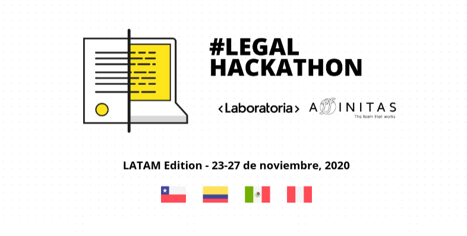

### Descripcion del reto

Crear una plataforma virtual, enfocada en la operación (supervisores y jefes) que requieren la aplicación de disciplina laboral, en la cual un usuario acreditado con una contraseña pueda:

- Incorporar la información de la persona o personas involucradas, los jefes y supervisores, los hechos y circunstancias, los medios probatorios, antecedentes, entre otros datos.
- Informarse de datos importantes de disciplina laboral durante la interacción con la plataforma.

### Demo del proyecto

**Este proyecto fue realizado con [Angular](https://github.com/angular/angular-cli) version 10.1.7**

[Demo del Proyecto](https://oriananohemi.github.io/legal-hackaton-ransa/auth)

Para ingresar puedes ingresar al demo con el correo: *jefe1@ransa.com* con la contraseña: _123456789_

### Equipo

<figure>

<figcaption>
  <a href="https://github.com/soydulceangelina">Dulce Mercado</a>
</figcaption>
</figure>
<figure>

<figcaption>
  <a href="https://github.com/MilagrosRn">Milagros Rodriguez</a>
</figcaption>
</figure>
<figure>

<figcaption>
  <a href="https://github.com/oriananohemi">Oriana Reina</a>
</figcaption>
</figure>
<figure>

<figcaption>
  <a href="https://www.linkedin.com/in/lesliebenel/">Leslie Bernel</a>
</figcaption>
</figure>

### Proyecto realizado para Legal Hackaton - Laboratoria 2020

  

